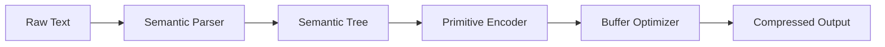

# Concepts Overview

## What is ΣLANG?

ΣLANG (Sigma Language) is a Sub-Linear Algorithmic Neural Glyph Language designed for extreme LLM compression. It encodes semantic meaning using compact glyphs, achieving **10-50x compression** while preserving information content.

### Core Principle

Human natural language is verbose and contains significant scaffolding. ΣLANG strips away redundancy and encodes meaning directly:

```
Human language: "Could you please create a function that sorts a list?"
Bytes: ~52
ΣLANG: Σ[CREATE:FUNCTION] → Σ[SORT:LIST]
Bytes: ~8
Compression: 6.5x
```

## Three-Tier Primitive System

ΣLANG uses a hierarchical system of semantic primitives:

### Tier 0: Existential Primitives (Σ₀₀₀ - Σ₀₁₅)
Universal semantic concepts shared across all domains:

- **ENTITY**: Concrete or abstract things (people, objects, concepts)
- **ACTION**: Dynamic processes or events
- **RELATION**: Connections between entities
- **ATTRIBUTE**: Properties or qualities
- **QUANTITY**: Numerical or measurable aspects
- **TEMPORAL**: Time-related concepts
- **SPATIAL**: Location and geometry
- **CAUSAL**: Causality and dependencies

### Tier 1: Domain Primitives (Σ₀₁₆ - Σ₁₂₇)
Specialized encodings for specific domains:

- **Code**: Functions, variables, classes, control flow
- **Math**: Operations, equations, matrices
- **Logic**: Boolean operations, conditions
- **Communication**: Language constructs, dialogue
- **Data Structures**: Arrays, maps, graphs
- **Relationships**: Hierarchies, networks, taxonomies

### Tier 2: Learned Primitives (Σ₁₂₈ - Σ₂₅₅)
Dynamically allocated based on usage patterns and learned from specific datasets.

## Semantic Tree Representation

ΣLANG represents parsed text as a semantic tree:

```
Input: "Apple Inc manufactures smartphones"

SemanticTree:
├── Root: ENTITY(Apple Inc)
│   └── ACTION(manufactures)
│       └── OBJECT: ENTITY(smartphones)
├── Relationships:
│   └── ORGANIZATION: Apple Inc
│   └── PRODUCT: smartphones
└── Metadata:
    └── Domain: technology
    └── Sentiment: neutral
```

## Compression Pipeline



## Key Algorithms

### Sub-Linear Search
Efficient entity and relationship lookup using spatial indexing instead of linear scan.

### Lossless Compression
Entropy-based encoding preserves all semantic information with zero data loss.

### Analogy Engine
Semantic reasoning through vector operations and relation mapping:

```
king - man + woman = queen
(RULER) - (MALE) + (FEMALE) = (FEMALE_RULER)
```

## Use Cases

### LLM Prompt Compression
Reduce token usage by 10-50x, lowering inference costs and latency.

### Log Compression
Compress application logs while maintaining queryability.

### Data Transmission
Reduce bandwidth requirements for text-heavy data transfers.

### Storage Optimization
Minimize storage footprint for text archives and documentation.

### Semantic Search
Enable fast, meaningful similarity search on compressed representations.

## Performance Characteristics

| Metric | Value |
|--------|-------|
| Compression Ratio | 10-50x |
| Encoding Speed | ~1µs/byte |
| Decoding Speed | ~2µs/byte |
| Memory Overhead | <2MB for most documents |
| Supported Text Size | 1 byte to 2GB |

## Next Steps

- Learn about [Semantic Primitives](primitives.md)
- Explore [Compression Techniques](compression.md)
- Understand the [Analogy Engine](analogy.md)
